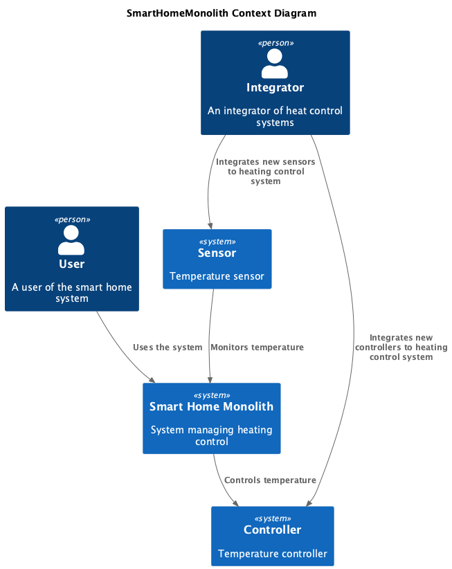
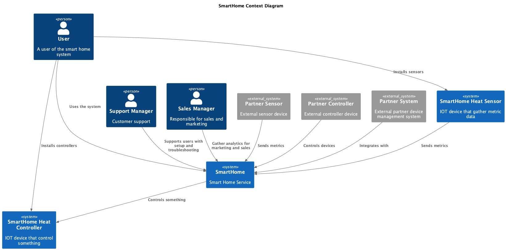
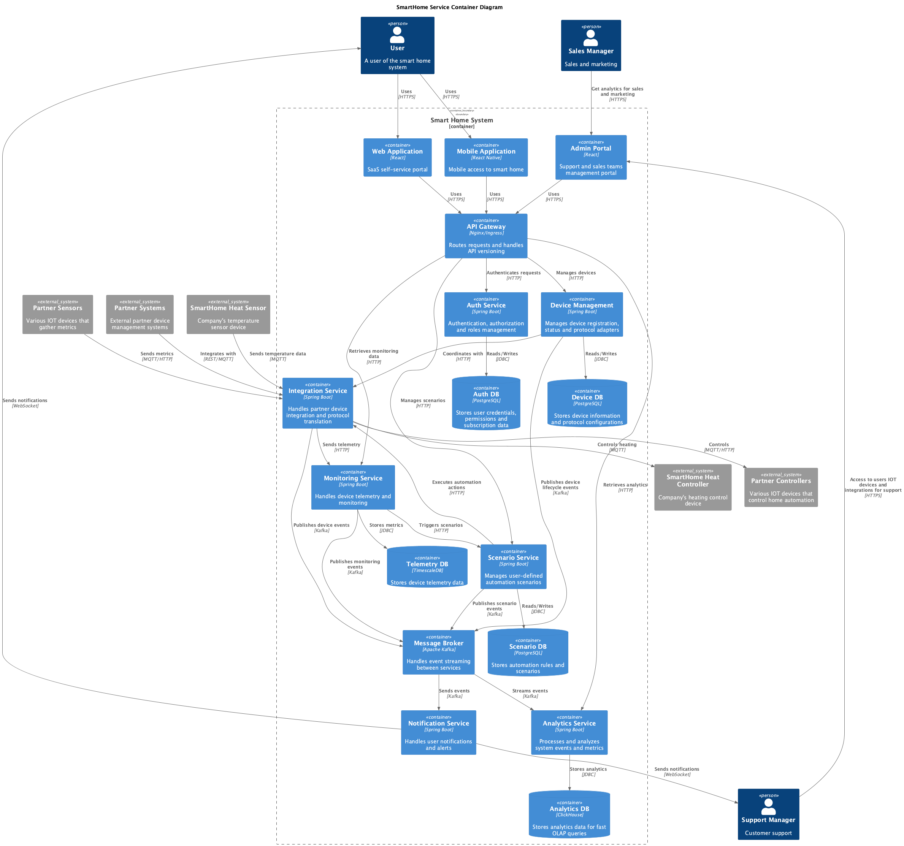
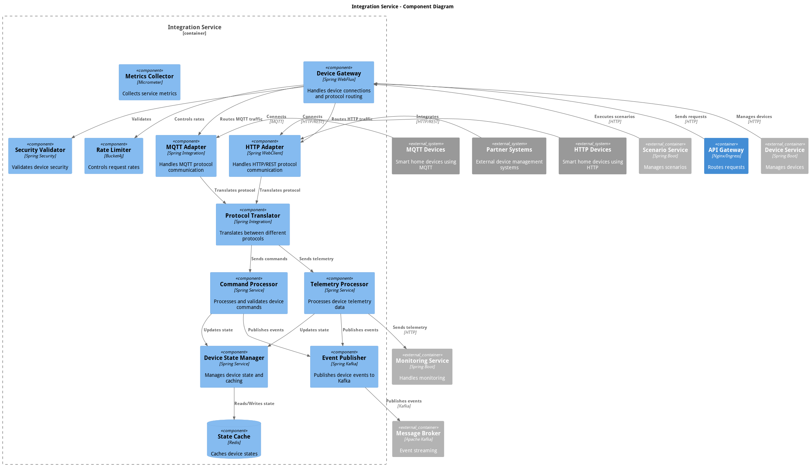
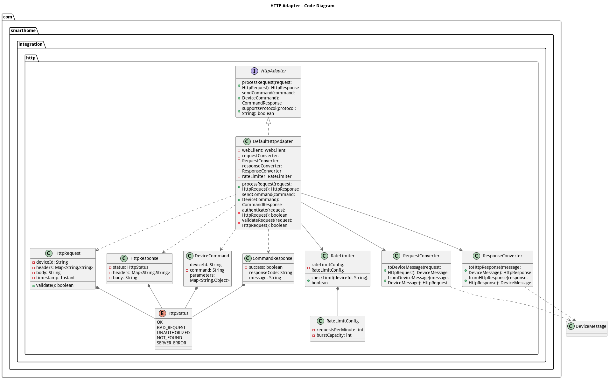
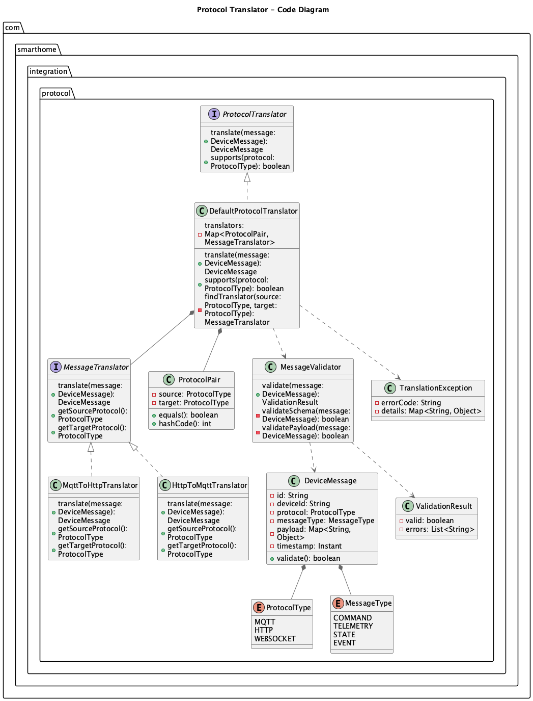
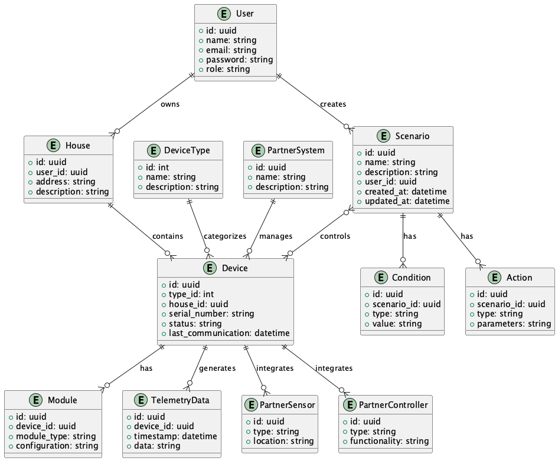

# Project_template

Тип: Материал
Родитель: Описание проекта для 11 когорты (https://www.notion.so/11-03abbbbc8bcb49ed9b85c9b6d1174056?pvs=21)

Это шаблон для решения проектной работы. Структура этого файла повторяет структуру заданий. Заполняйте его по мере работы над решением.

# Задание 1. Анализ и планирование

<aside>
💡

Чтобы составить документ с описанием текущей архитектуры приложения, можно часть информации взять из описания компани и условия задания. Это нормально.

</aside>

### 1. Описание функциональности монолитного приложения

**Управление отоплением:**

- Управление отоплением. Пользователи могут удалённо включать/выключать отопление в своих домах.
- Установка температуры. Пользователи могут устанавливать желаемую температуру в своих домах через веб-интерфейс.

**Мониторинг температуры:**

- Мониторинг температуры. Система получает данные о температуре с датчиков, установленных в домах. Пользователи могут просматривать текущую температуру в своих домах через веб-интерфейс.

### 2. Анализ архитектуры монолитного приложения

* Язык программирования: Java. Достаточно хороший выбор для создания веб-приложений, особенно с использованием Spring Boot. Разработчиков найти не сложно. Есть ньансы по длительному старту после перезапуска.
* База данных: PostgreSQL. Отличный выбор, может быть и RDBMS и noSQL одновременно. Может масштабироваться горизонтально независимо от приложения.
* Архитектура: Монолитная, все компоненты системы (обработка запросов, бизнес-логика, работа с данными) находятся в рамках одного приложения. Сложно поддержка, тестирование и масштабирование.
* Взаимодействие: Синхронное, запросы обрабатываются последовательно. Низкая скорость обработки запросов, но при этом нет проблем с консистентностью данных.
* Масштабируемость: Ограничена, так как монолит сложно масштабировать по частям. Можно масштабировать как вертикально, добавляя ресурсы к серверу, так и горизонтально, добавляя инстансы и подключая баланисировку между ними, если вынести систему хранения данных в отдельный сервис.
* Развёртывание: ~~Требует остановки всего приложения~~. При наличии k8s это не так критично, потому что трафик на новую версию пойдет только после успешного деплоя. До этого старая версия будет нормально работать. То есть со стороны пользователя не будет простоев. 

### 3. Определение доменов и границы контекстов

Домен - **управление отоплением**, отвечает за работу с отоплением.

Поддомены:
* Управление отоплением
* Мониторинг температуры

Домен - **подключение к системе**, отвечает за работу с новыми подключениями. В коде реализации нет, но в условии задания есть упоминание о том, что система должна поддерживать возможность подключения новых пользователей через вызов специалиста, значит это часть бизнеса.

Поддомены:
* Менеджмент подключений

### **4. Проблемы монолитного решения**
Особых проблем для текущего состояния бизнеса не наблюдается, потому что монолит проще в поддержке небольшой командой и фактически выходит дешевле для небольших проектов.

Плюсы текущего решения:
* Простота развертывания и управления.
* Отсутствие необходимости в сложной инфраструктуре.
* Отсутствие необходимости в сложной настройке взаимодействия между сервисами.
* Отсутствие необходимости в сложной настройке мониторинга и логирования.

Минусы:
* Отсутствие аутентификации и авторизации(возможно это не присутствует в исходном решении).
* Отсутствие возможности масштабирования отдельных компонентов.
* Отсутствие возможности использования разных технологий для разных частей системы.
* Отсутствие возможности использования разных баз данных для разных частей системы.
* Отсутствие возможности использования разных языков программирования для разных частей системы.
* Отсутствие возможности релиза новых функций через feature-flags или канареечные релизы.

### 5. Визуализация контекста системы — диаграмма С4

# Задание 2. Проектирование микросервисной архитектуры

В этом задании вам нужно предоставить только диаграммы в модели C4. Мы не просим вас отдельно описывать получившиеся микросервисы и то, как вы определили взаимодействия между компонентами To-Be системы. Если вы правильно подготовите диаграммы C4, они и так это покажут.

**Обновленная диаграмма контекста (Context)**

**Диаграмма контейнеров (Containers)**

**Диаграмма компонентов (Components)**

**Диаграмма кода (Code)**

# Задание 3. Разработка ER-диаграммы

Четвёртое задание — дополнительное. Его можно сделать по желанию. Чтобы ревьюер быстрее проверил ваше решение, укажите, сделали вы это задание или нет. Для этого оставьте нужный эмодзи около заголовка задания:

# ❌ Задание 4. Создание и документирование API

### 1. Тип API

Укажите, какой тип API вы будете использовать для взаимодействия микросервисов. Объясните своё решение.

### 2. Документация API

Здесь приложите ссылки на документацию API для микросервисов, которые вы спроектировали в первой части проектной работы. Для документирования используйте Swagger/OpenAPI или AsyncAPI.
